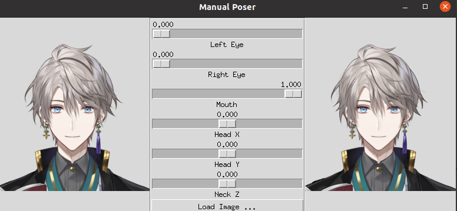

# Talking head TRT
 This is the TensorRT implementation of the pose generation network of talking-head anime model as published at [Talking_head](https://github.com/pkhungurn/talking-head-anime-demo). 

## Repo structure :

    |--layers.py: Implementations of some basic TRT layers used in the network
    |--build_varshape.py: Source codes that build a trt engine
    |--run_inference.py: Model inference scripts
    |--app.py: Source codes for a simple gui app
    |--config: Model configurations
    |--data: Pretrained model checkpoints
    |--gridSamplerPlugin: Source codes of gridSamplerPLugin
    |--images: Directory that stores sample input images 
    |--results: Directory that stores inference results

## Requirements
CUDA >= 11.1  
TensorRT >= 7.2   
Python >= 3.6.5

Recommend using nvcr.io/nvidia/pytorch:20.12-py3 docker image.

## Obtain necessary data

## Build Plugins
To run the sample, plugins must be built first as they are written in C++.  
Go to gridSamplerPlugin and compile: 
> ./compile.sh

Additionally, in order to enable dynamic shapes, we need to build the instancenormalization plugin located at https://github.com/NVIDIA/TensorRT/tree/master/plugin/instanceNormalizationPlugin, after deleting hightlighted lines as shown below

## Build engine and run sample inference
in order to build the engine run
>python build_varshape.py -o model.engine --fp16 -vv -w 5000

After the engine is built
we can run inference on a sample image using, for example
>python run_inference.py -e model.engine -n 300 -s images/img_8.png -f 5 -o results/output_1.gif

## GUI Application
you can also run a simple desktop GUI application using
>python app.py

